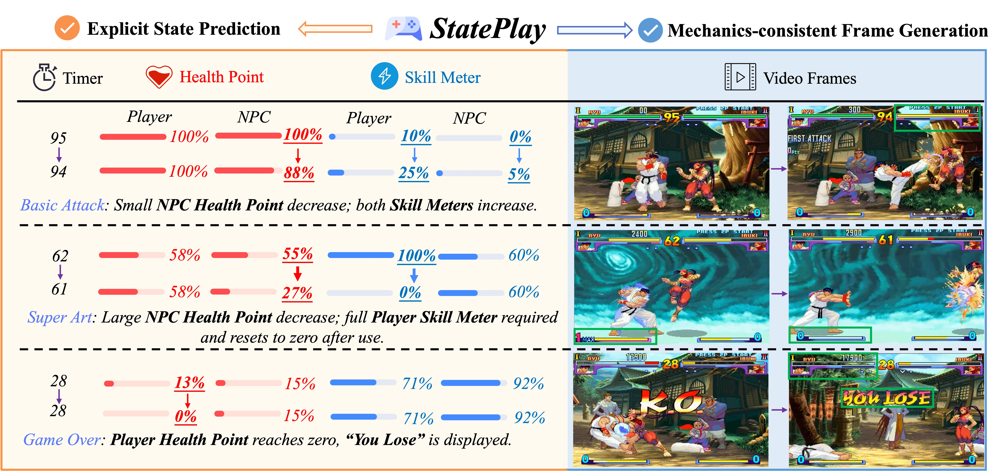

# StatePlay: State-Aware Game World Models for Mechanics-Consistent Generation

<p>
<a href="https://jimntu.github.io/stateplay_page/"></a>
<a href="https://arxiv.org/abs/2607.26754"></a>
<a href="https://github.com/Jimntu/StatePlay"></a>
<a href="https://huggingface.co/onepiece1999/StatePlay"></a>
<a href="https://huggingface.co/datasets/onepiece1999/StatePlay-Dataset"></a>
</p>

> ## **StatePlay: State-Aware Game World Models for Mechanics-Consistent Generation**
>
> Zijun Lin<sup>1,2,4</sup>,
> Zeqing Wang<sup>1,3</sup>,
> Cheston Tan<sup>4</sup>,
> Bihan Wen<sup>2</sup>,
> Yeying Jin<sup>1,3</sup>
>
> <sup>1</sup>Tencent,
> <sup>2</sup>Nanyang Technological University,
> <sup>3</sup>National University of Singapore,
> <sup>4</sup>A*STAR

## Introduction

StatePlay: Beyond pixel-level realism toward mechanics-consistent Game World Models! Instead of modeling gameplay through visual observations alone, we explicitly predict internal game states and use them to guide frame generation, ensuring consistency with the underlying game mechanics.


## Installation

Requirements: Python 3.10+, CUDA, and a GPU with bfloat16 support.

```bash
git clone https://github.com/Jimntu/StatePlay.git
cd StatePlay
python -m venv .venv
source .venv/bin/activate
pip install -U pip
pip install -e .
```

### Model downloads

| Resource | Required for | Files | Download |
|---|---|---|---|
| StatePlay checkpoint | Inference | `StatePlay.safetensors` | [Hugging Face](https://huggingface.co/onepiece1999/StatePlay/tree/main) |
| Wan2.2 VAE and T5 | Inference and training | `Wan2.2_VAE.pth`, `models_t5_umt5-xxl-enc-bf16.pth` | [Hugging Face](https://huggingface.co/Wan-AI/Wan2.2-TI2V-5B/tree/main) |
| UMT5 tokenizer | Inference and training | `google/umt5-xxl/` | [Hugging Face](https://huggingface.co/Wan-AI/Wan2.1-T2V-1.3B/tree/main/google/umt5-xxl) |
| Wan2.2 DiT base weights | Training only | Three `diffusion_pytorch_model-*.safetensors` shards | [Hugging Face](https://huggingface.co/Wan-AI/Wan2.2-TI2V-5B/tree/main) |

Expected inference layout:

```text
StatePlay/
├── examples/checkpoint/StatePlay.safetensors
└── base_model/Wan-AI/
    ├── Wan2.2-TI2V-5B/
    │   ├── Wan2.2_VAE.pth
    │   └── models_t5_umt5-xxl-enc-bf16.pth
    └── Wan2.1-T2V-1.3B/google/umt5-xxl/
        └── ... tokenizer files ...
```

To keep weights elsewhere:

```bash
export STATEPLAY_BASE_MODEL=/absolute/path/to/base_model
export STATEPLAY_CHECKPOINT=/absolute/path/to/StatePlay.safetensors
```

`STATEPLAY_BASE_MODEL` must directly contain `Wan-AI/`.

## Code architecture

StatePlay uses separate visual and state transformer branches with shared joint
attention. The visual branch predicts video latents; the state branch predicts
the five normalized game states. Both branches are conditioned on the initial
frame, text prompt, and action sequence.

```text
StatePlay/
├── stateplay/
│   ├── pipeline.py             # public inference pipeline
│   ├── cli.py                  # command-line inference
│   └── models/
│       ├── dit.py              # StatePlay visual/state DiT
│       ├── vae.py              # video VAE wrapper
│       └── text_encoder.py     # text encoder wrapper
├── training/
│   ├── train.py                # training entry point
│   ├── runner_with_state.py    # optimization/checkpoint loop
│   └── data/                   # SF3 action, state, and prompt loading
├── diffsynth/                  # minimal Wan/StatePlay dependencies
├── scripts/
│   ├── inference.sh
│   ├── run_examples.sh
│   └── train.sh
└── examples/
    ├── inputs/                 # eight bundled inputs
    ├── checkpoint/             # local checkpoint
    └── generated/              # generated videos and state predictions
```

## Run examples

Generate all eight bundled examples:

```bash
export CUDA_VISIBLE_DEVICES=0
./scripts/run_examples.sh
```

Generate selected examples:

```bash
./scripts/run_examples.sh --only 01 03
```

Outputs are written to `examples/generated/`. Each example produces an MP4 and
a `_state.txt` file. The model is loaded once for the entire run.

## Inference

```bash
export CUDA_VISIBLE_DEVICES=0

./scripts/inference.sh \
  --image examples/inputs/01_macro_success_clip/first_frame.png \
  --actions examples/inputs/01_macro_success_clip/actions.parquet \
  --prompt-file examples/inputs/01_macro_success_clip/prompt.txt \
  --output output.mp4
```

This writes `output.mp4` and `output_state.txt`. Defaults are 101 frames,
30 denoising steps, text CFG 5.0, state/action CFG 1.0, and seed 2.

Use custom model paths through `STATEPLAY_BASE_MODEL` and
`STATEPLAY_CHECKPOINT`, or inspect all options with:

```bash
./scripts/inference.sh --help
```

## Training

Download the [StatePlay dataset](https://huggingface.co/datasets/onepiece1999/StatePlay-Dataset/tree/main)
and the Wan2.2 DiT initialization weights listed in the model table above.

Run training:

```bash
export STATEPLAY_BASE_MODEL="$PWD/base_model"
export STATEPLAY_DATA_ROOT="$PWD/data/StatePlay-Dataset/SF3"
export STATEPLAY_OUTPUT="$PWD/outputs/StatePlay"
export CUDA_VISIBLE_DEVICES=0,1,2,3

./scripts/train.sh
```

The script derives the process count from `CUDA_VISIBLE_DEVICES`. It trains at
480×832 with 101 frames, learning rate `5e-5`, state sampling `end`, and saves
every 500 steps.
